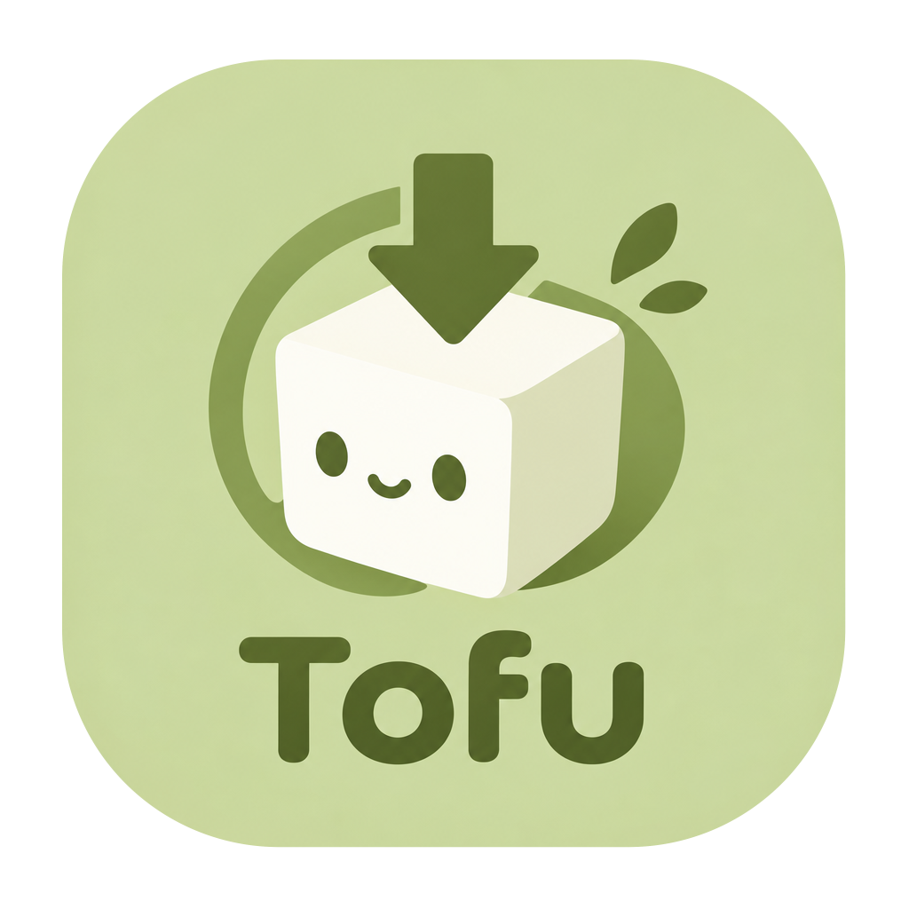

# Tofu

A desktop torrent client with a clean interface, real transfer stats, and built-in anime tracking.

Built with **Bun · React · Furin · Electrobun · WebTorrent**, using **shadcn + Base UI**.

## ✨ What you can do

- **Download your way** — add magnets, torrent URLs, or `.torrent` files, including drag and drop.
- **Keep things organized** — give each destination its own tab and folder.
- **Stay in control** — pause, resume, set file priorities, manage trackers, and verify downloads.
- **Follow new releases** — search Nyaa, Tsundere-Raws, and C411; automate downloads with optional Jev and AniList integrations.
- **Pick up where you left off** — downloads and settings survive restarts; background mode keeps transfers running.

Files stay on disk unless you explicitly choose to delete them. Unavailable stats appear as `—`.

## 📦 Install

Download an installer matching your system from [Releases](https://github.com/Teyik0/Tofu/releases). The release pipeline targets macOS Apple Silicon, Windows x64, and Linux x64/ARM64.

On macOS, open the DMG and move Tofu to Applications. On Windows, extract the entire ZIP before running `Tofu-Setup.exe`; keep its `.installer` folder alongside it. On Linux, extract the `.tar.gz` and run `./installer`.

On macOS, choose **Tofu → Set as default torrent app** to open `.torrent` files and magnet links with Tofu. Opening a torrent starts it in your saved download folder; reopening an existing torrent preserves its destination and paused state. You can also select Tofu in Finder's **Get Info → Open with → Change All…** for `.torrent` files. The development app does not advertise file or magnet associations.

See the [release guide](docs/releases.md) for updates and signing details. macOS Apple Silicon is the currently validated platform.

## 🚀 Run from source

You need **Bun 1.4+**. macOS also requires **Xcode Command Line Tools**. Linux requires GTK 3, WebKitGTK 4.1, Ayatana AppIndicator, and librsvg; see the [development guide](docs/development.md).

```sh
git clone https://github.com/Teyik0/Tofu.git
cd Tofu
bun install --ignore-scripts
bun run setup
bun run prepare
bun run build:desktop
bun run desktop
```

For web development, run `bun run dev` (`TOFU_PROFILE=dev bun --hot src/server.ts`) and open **http://127.0.0.1:3030**.

Want to try a real local transfer? Keep `bun run demo` running while Tofu is open.

## 🧩 Plugins

Plugins are optional and start disabled. Enable them from **Plugins** in the sidebar.

| Plugin | What it adds |
| --- | --- |
| Nyaa | Torrent search and release feeds |
| Tsundere-Raws | Recent releases from the official JSON feed |
| C411 | Torznab search with your API key |
| Jev · TypeSafe | Natural language search and release matching |
| AniList | Track selected anime from Watching and Plan to Watch |

[Plugin guide →](docs/plugins.md)

## 🛠️ Development

The desktop commands use the Furin Electrobun CLI directly. Bundle outputs and release artifacts stay under `.furin/electrobun/`. Build once before typechecking to prepare the Hutch SDK types.

```sh
bun run tscheck
bun run fix
bun run test
bun run build:desktop
bun run test:native
```

`bun run test` runs exactly `bun test --parallel --isolate --bail`. Tests use real peers, local trackers, and temporary folders. The native test also checks the actual desktop interface and requires a graphical session.

[Architecture & configuration](docs/development.md) · [Contributing](CONTRIBUTING.md) · [Security](SECURITY.md) · [Changelog](CHANGELOG.md) · [Benchmarks](BENCHMARK.md)

Licensed under [MIT](LICENSE.md).
